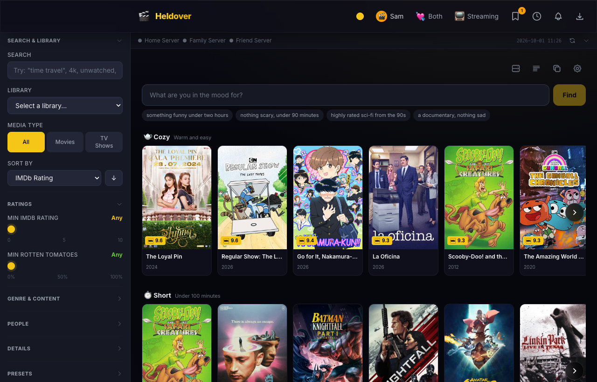
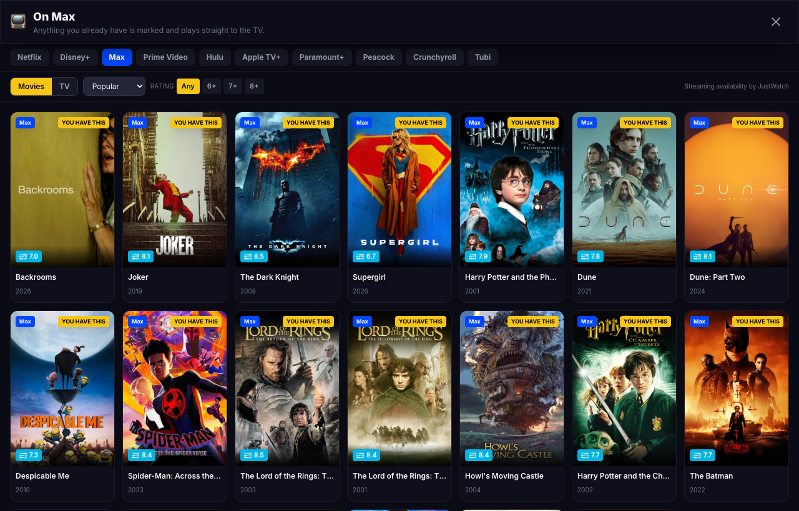
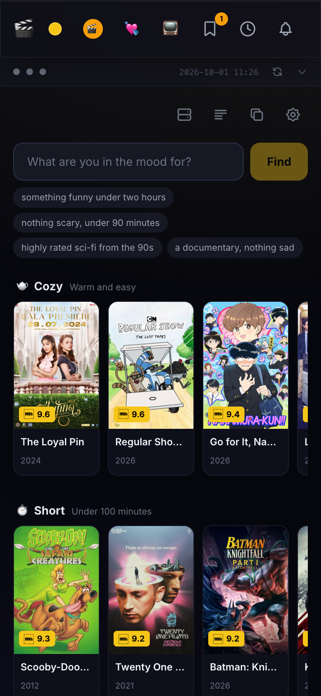

<div align="center">

# 🎬 Heldover for Plex

**Now showing: tonight's pick.**

Find something worth watching across every Plex server you can reach, your own and the ones friends share with you. Filter by real ratings, ask in plain words, swipe together, and send it to the TV.

[](LICENSE)
[](https://nodejs.org)
[](https://github.com/anthonyonazure/heldover/pkgs/container/heldover)

[](https://buymeacoffee.com/mindmap)



</div>

---

## What it does

- **Every library in one place.** Your servers and shared ones, searched and filtered together.
- **Real ratings.** IMDb, Rotten Tomatoes, TMDB, Metacritic, Letterboxd and more, instead of the flat numbers shared servers often report.
- **Ask in plain words.** "Something funny under two hours" or "nothing scary, from the 90s".
- **Mood shelves.** Cozy, short, mind-bending, new this week, picked from titles you can actually play.
- **Swipe together.** Two phones, one deck. The app names the first film you both said yes to.
- **Profiles.** Each person gets their own thumbs, watchlist, queue and recommendations.
- **Streaming browse.** See what is on Netflix, Disney+, Max and others, with titles you already have marked.
- **Send it to the TV.** Casts to most smart TVs over DLNA, no Plex app needed on the TV. Files the TV cannot play are converted on the fly (needs ffmpeg). Phones and other devices can only send films to TVs the owner has approved under **Settings**, **TVs**; a TV the owner casts to is approved automatically.
- **Works on phones.** Open it from any device on your Wi-Fi.

<div align="center">
  
  
</div>

---

## Install

Pick one. All three end at the same setup screen.

### Docker (home servers: Unraid, Synology, any Linux box)

```bash
mkdir heldover && cd heldover
curl -O https://raw.githubusercontent.com/anthonyonazure/heldover/main/docker-compose.yml
docker compose up -d
```

Then open `http://<that-machine>:3001`. Setting up from another device asks for the **settings code**, which Heldover prints when it starts: run `docker logs heldover` to see it.

Data lives in `./data` next to the compose file. The container creates that folder and makes it writable by itself. On Unraid or Synology, set `PUID` and `PGID` in the compose file so the files belong to your own user (Unraid: `99` and `100`).

The compose file uses **host networking** so the app can find TVs on your network. You can use Docker's usual bridge networking instead (the second example in the compose file): everything works except casting to the TV, which needs host networking. In bridge mode the app only knows the container's internal address, so open `http://<your server's address>:<the port you mapped>`.

### Desktop app (Windows, macOS, Linux)

Download from [Releases](https://github.com/anthonyonazure/heldover/releases/latest): `.exe`, `.dmg` or `.AppImage`. The Mac download is for Apple-chip Macs (M1 and later). On an Intel Mac, use Docker or run from source.

The builds are not code-signed, so the first launch shows a warning:

- **macOS:** try to open the app once and close the warning. Then open **System Settings > Privacy & Security**, scroll down to the message about Heldover, and choose **Open Anyway**. (Since macOS 15, right-click and **Open** no longer gets past the warning.)
- **Windows:** on "Windows protected your PC", choose **More info**, then **Run anyway**.

The desktop app starts out reachable only from the computer it runs on. To open it from phones as well, see [Using it on your phone](#using-it-on-your-phone).

### From source

Needs [Node.js 22 or newer](https://nodejs.org). ffmpeg is optional (TV casting of files the TV cannot play).

```bash
git clone https://github.com/anthonyonazure/heldover.git
cd heldover
cd client && npm install && npm run build && cd ..
cd server && npm install && npm start
```

Open `http://localhost:3001`.

---

## First run


1. **Sign in with Plex.** The app shows a 4-character code. Enter it at [plex.tv/link](https://plex.tv/link) from any device. (You can paste a Plex token instead if you already have one.)
2. **Add a TMDB key.** Free, and powers ratings, trailers, streaming info and recommendations. Get one at [themoviedb.org/settings/api](https://www.themoviedb.org/settings/api).
3. **Who watches here?** One name per person.
4. **Optional PIN.** Without a PIN, other devices on your Wi-Fi can open Heldover and look around, but cannot change anything. If your household wants to rate, queue and cast from their phones, set a PIN (6 to 12 digits) and share it with them. Each device asks once.

Everything can be changed later under **Settings** (the gear icon).

### Who can change settings

There are three levels:

- **Look around** (browse, search, see ratings): any device on your Wi-Fi. Once a PIN is set, only devices that have entered it.
- **Change things** (rate, hide, queue, swipe, cast to the TV, download): devices that have entered the PIN. Without a PIN, only the owner. These devices can cast only to TVs the owner has approved.
- **Change settings** (the Plex account, keys, the PIN, downloads, which TVs are approved): only the **owner**.

The owner is:

- the computer Heldover runs on (the desktop app, or a browser on that same computer at the `localhost` address it prints when it starts);
- any other device where you have entered the **settings code**. It is printed every time Heldover starts: in the terminal, or with `docker logs heldover`. The desktop app shows it in Settings on that computer. Each device needs it once.

In a Docker container on bridge networking, or behind a reverse proxy, Heldover cannot tell that a request comes from its own computer. There, every device uses the settings code, the server itself included.

Forgot the PIN? Start Heldover once with `RESET_PIN=1` to clear it, or change it in Settings as the owner.

### Optional extras

Add these in Settings for more rating sources:

| Service | Adds | Free tier |
|---|---|---|
| [OMDb](https://www.omdbapi.com/apikey.aspx) | IMDb and Rotten Tomatoes scores | 1,000 a day |
| [MDBList](https://mdblist.com/preferences/) | Letterboxd, Trakt, audience scores | 1,000 a day |
| [Fanart.tv](https://fanart.tv/get-an-api-key/) | Backdrops and logos. Fanart.tv asks apps to use a **project** API key, so request a project key on that page, not only a personal one. | yes |

### Downloads

Download buttons are **off** by default. They copy files from the server a title lives on, and that server may belong to someone who shared their library with you. Turn them on in Settings only if they are fine with that.

For a shared server, Heldover only offers downloads when its owner has turned on **Allow Downloads** for you in Plex.

Heldover passes through up to 20 connections for one file and 100 in all at one time. A download manager set higher is refused for the extra ones.

---

## Using it on your phone

Open `http://heldover.local:3001` (or `http://<computer-ip>:3001`) on any device on the same Wi-Fi, iPhone and Android alike. Add it to your home screen for an app-like icon.

- **Installed from source or with Docker:** other devices on your network can open it from the start. The server prints its addresses, and a QR code, when it starts.
- **Desktop app:** it opens only on its own computer until you turn on **Let phones and other devices on my Wi-Fi connect** in Settings. Settings then shows the address to open on your phone.

A phone can look around straight away. To rate, queue or cast from it, set a PIN in Settings and enter it on the phone (see [Who can change settings](#who-can-change-settings)).

## Configuration

Setup covers everything most people need. For automation, these environment variables are also read (anything saved in Settings wins):

| Variable | Default | Purpose |
|---|---|---|
| `PORT` | `3001` | Port the app listens on |
| `BIND_HOST` | `0.0.0.0` | The address the app listens on. `0.0.0.0` lets every device on your network open it; `127.0.0.1` (or `localhost`) keeps it to this computer. It must be an IP address with no port; anything else stops Heldover from starting, so a typing mistake cannot open it to the whole network. Leave it alone in Docker. |
| `DATA_DIR` | `server/data` (`/data` in Docker) | Database, poster cache, settings. If the settings file there (`config.json`) is damaged or cannot be read, Heldover stops and says so; it does not start over with blank settings, because that would drop your PIN. Repair the file, or move it away to start again with new settings. Heldover then begins at the setup screen, unless your Plex token comes from the environment and the database is still there: then it skips the setup screen and starts with downloads off and no PIN, and says so in the log. |
| `PUID` / `PGID` | `1000` / `1000` | Docker only. The user and group the app runs as, which own the files in `./data` (Unraid: `99` / `100`) |
| `PLEX_TOKEN`, `TMDB_API_KEY`, `OMDB_API_KEY`, `MDBLIST_API_KEY`, `FANART_API_KEY` | | Same as the setup screen |
| `OMDB_DAILY_LIMIT` / `MDBLIST_DAILY_LIMIT` | `950` / `1000` | Raise if you pay for a higher tier |
| `TRAKT_CLIENT_ID` | | Optional. A [Trakt](https://trakt.tv/oauth/applications) API client ID. Adds Trakt's trending, popular and anticipated lists to **Browse lists**. |
| `GOPEED_URL` | `http://localhost:9999` | Optional. The address of a [Gopeed](https://gopeed.com) download manager, used only when downloads are on and you send one to it |
| `FFMPEG_PATH` | found automatically | Where ffmpeg lives |
| `DISABLE_MDNS` | | Set to `1` to stop announcing `heldover.local` |
| `MDNS_NAME` | `heldover` | The `.local` name to announce |
| `ALLOWED_HOSTS` | | Extra host names to accept, comma separated (for example your reverse proxy's domain). Home names (`.local`, `.lan`, IP addresses, plain machine names) always work. |
| `TRUST_PROXY` | | Set when a reverse proxy sits in front (for example `1` for one hop), so lockouts and secure cookies use the real client. Visitors who come through the proxy are never treated as the computer Heldover runs on; they use the settings code to manage it. |
| `PLEX_ALLOW_HTTP` | | Heldover talks to Plex servers over `https` only. Set to `1` to also use plain `http` addresses, for a server that has secure connections turned off, or when your router will not look up `plex.direct` names (the other fix for that is to allow `plex.direct` in the router's DNS rebinding protection). Any machine that answers at a plain `http` address can then receive your Plex token. |
| `RESET_PIN` | | Set to `1` for one start to remove a forgotten PIN |

## What it connects to

Heldover talks to these outside services and nothing else. There are no analytics and no telemetry, and the fonts are part of the app.

- **plex.tv and your Plex servers** (your own and shared ones): to sign in, read libraries, play and cast, and keep your Plex watchlist.
- **TMDB**: ratings, trailers, streaming availability, recommendations and its lists. Your devices load some posters and backdrops straight from TMDB's image servers as you browse.
- **OMDb, MDBList, Fanart.tv**: only if you add their keys. With a Fanart.tv key, your devices load backdrops and logos from Fanart.tv.
- **YouTube**: only when a trailer plays, through YouTube's privacy-enhanced player (`youtube-nocookie.com`).
- **Letterboxd**: only when you open one of its lists under **Browse lists**. The app then reads that public list from letterboxd.com. No account or key is involved.
- **Trakt**: only if you set `TRAKT_CLIENT_ID`, and only when you open one of its lists.

Links to streaming services (Netflix and the rest) open in your browser only when you click them.

## Security notes

- Your Plex sign-in and API keys stay on the machine running Heldover. The browser never receives them.
- Your Plex token is sent to a Plex server only over `https`, where the server's certificate proves which machine is answering. A server that offers only plain `http` is left out unless you set `PLEX_ALLOW_HTTP=1` (see [Configuration](#configuration)).
- The app is meant for your home network. Do not expose it to the internet. If you want access from outside, use a VPN such as Tailscale or WireGuard.
- Without a PIN, other devices on your Wi-Fi can look but not change anything: rating, hiding, queueing, swiping, casting and downloading need the PIN or the settings code.
- With a PIN set, the app's data needs the PIN; the only exceptions are links the app itself hands to your TV or a download, which expire. A TV link works only from that TV, and it stops working when the owner removes that TV, when the TV refuses the cast, or when the film is stopped from the app.
- Settings can only be changed by the owner (see above), so a guest on your Wi-Fi cannot relink Plex, change keys or lock you out. Wrong PIN tries are limited, and they never hold up the settings code, so a guest cannot keep you from signing in as the owner on another device.
- The desktop app is reachable only from its own computer until you turn on the switch in Settings that lets other devices connect.
- Requests for unknown domain names and from other websites are refused, which blocks web pages that try to reach the app through your browser.
- Found a security problem? Please report it privately; see [SECURITY.md](SECURITY.md).

---

## Development

```bash
cd server && npm install && npm run dev      # API on :3001, restarts on change
cd client && npm install && npm run dev      # UI on :3000, proxies /api to :3001
cd server && npm test                        # core tests
```

Two tools are used. **npm** installs and runs everything, with one lockfile per folder (`server`, `client`, `electron` and the root); `npm install` at the root also installs the three sub-projects, Electron included. **bun** runs the root checks: `bun run check` (typecheck and style check) and `bun test` (the pure tests in `server/src`).

Building the desktop app locally: `cd electron && npm install`, build the client, then `npm run rebuild:server` (recompiles the database driver for Electron) and `npm run build:mac` (or `build:win`, `build:linux`). After that, run `npm rebuild` in `server/` before using `npm start` there again, because the driver is now compiled for Electron. Tagged releases are built by GitHub Actions.

```
heldover/
├── server/        Express API, SQLite, Plex/TMDB clients, TV casting
├── client/        React + Vite + Tailwind
├── electron/      Desktop wrapper
├── Dockerfile
└── docker-compose.yml
```

## Credits

- This application uses TMDB and the TMDB APIs but is not endorsed, certified, or otherwise approved by TMDB.
- Streaming availability data is provided by [JustWatch](https://www.justwatch.com).
- Ratings data from [OMDb](https://www.omdbapi.com) is licensed [CC BY-NC 4.0](https://creativecommons.org/licenses/by-nc/4.0/).
- Heldover is an independent project and is not affiliated with or endorsed by Plex, Inc.
- Streaming service names and logos belong to their owners.
- The Docker image includes [ffmpeg](https://ffmpeg.org), which is under its own license (GPL version 2 or later), not Heldover's.

## License

[MIT](LICENSE)
