# Welcome

Heldover helps you pick what to watch. You sign in with Plex. It then shows every server you can reach on one page: your own, and the ones friends have shared with you.

You do not have to open each server and scroll. You search, filter or just ask in plain words. Heldover shows what matches, with real ratings next to each title.

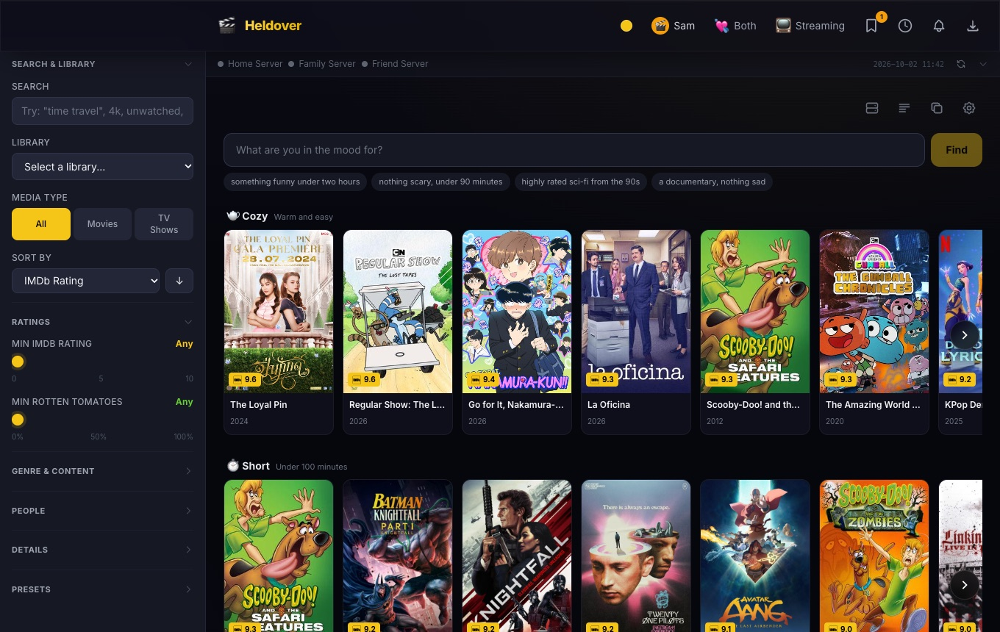

This guide takes you from install to your first movie night. Each chapter is short. You can read them in order or jump to the one you need.

**What you need**

- A Plex account, and at least one Plex server you can reach (your own, or one shared with you).
- A free TMDB key. Chapter 3 shows you how to get one.
- A computer to run Heldover on. It can be Windows, a Mac with an Apple chip, or Linux. A home server (Unraid, Synology or any Linux box) works too.

**What Heldover does not do**

Heldover does not play films itself. It finds them, then hands them to Plex, to your TV, or to a download. It also does not send your data anywhere. There are no accounts and no analytics. Chapter 15 lists the few outside services it talks to.

# 1. Install

Pick one of three ways. All three end at the same setup screen.

## The desktop app (easiest)

1. Open the [Releases page](https://github.com/anthonyonazure/heldover/releases/latest).
2. Download the file for your computer:
   - **Windows:** the file that ends in `.exe`.
   - **Mac:** the file that ends in `.dmg`. It is for Macs with an Apple chip (M1 or later). On an Intel Mac, use Docker or run from source.
   - **Linux:** the file that ends in `.AppImage`.
3. Open the file and follow the prompts.

The builds are not code signed. Signing costs money, and this is a free project. Because of that, your computer shows a warning the first time.

- **Windows:** you see "Windows protected your PC". Choose **More info**, then **Run anyway**.
- **Mac:** try to open the app once, then close the warning. Open **System Settings**, then **Privacy & Security**. Scroll down to the message about Heldover and choose **Open Anyway**.

You only do this once.

The desktop app starts out reachable only from the computer it runs on. Chapter 12 shows how to open it from your phone.

## Docker (for home servers)

Use this on Unraid, Synology or any Linux box.

```bash
mkdir heldover && cd heldover
curl -O https://raw.githubusercontent.com/anthonyonazure/heldover/main/docker-compose.yml
docker compose up -d
```

Then open `http://<that-machine>:3001` in a browser. Your data lives in a `data` folder next to the compose file.

The compose file uses host networking. That lets Heldover find TVs on your network. If you prefer Docker's normal networking, the compose file shows a second example.

## From source

You need [Node.js](https://nodejs.org) 22 or newer. The program ffmpeg is optional. It is only used to cast files that your TV cannot play on its own.

```bash
git clone https://github.com/anthonyonazure/heldover.git
cd heldover
cd client && npm install && npm run build && cd ..
cd server && npm install && npm start
```

Open `http://localhost:3001`.

# 2. The settings code

Every time Heldover starts, it prints a **settings code** (for example `ABCD-EFGH`). Keep it handy.

You need the code when you set up Heldover from a different device than the one it runs on. It proves that you are the owner.

- **Desktop app:** you do not need it on the same computer. Settings shows the code.
- **Docker:** run `docker logs heldover` to see it.
- **From source:** it is printed in the terminal.

# 3. First run

When you open Heldover for the first time, you see the setup screen.

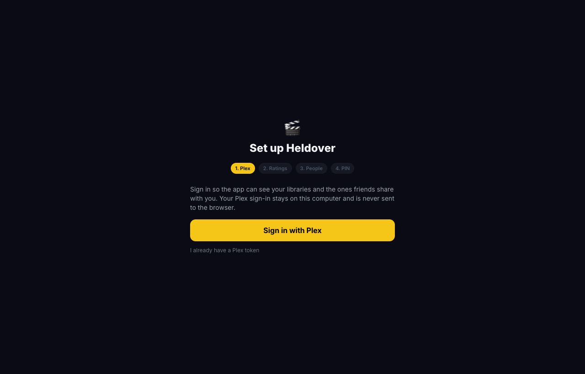

Work through it in order.

1. **Sign in with Plex.** Heldover shows a short code. Go to [plex.tv/link](https://plex.tv/link) on any device and enter it. If you already have a Plex token, you can paste that instead.
2. **Add a TMDB key.** TMDB is a free movie database. It powers ratings, trailers, streaming info and recommendations. Get a key at [themoviedb.org/settings/api](https://www.themoviedb.org/settings/api) and paste it in.
3. **Say who watches.** Add one name for each person in the house. Each person gets their own thumbs, queue and recommendations.
4. **Choose a PIN (optional).** A PIN is 6 to 12 digits. Chapter 13 explains why you may want one.

You can change all of this later under **Settings** (the gear icon).

# 4. A tour of the home screen

Look at the top bar first.

| Icon | Name | What it does |
|---|---|---|
| Your name | Who is watching | Switch between people in the house |
| Both | Both of you | Start a swipe round (chapter 8) |
| Streaming | Streaming | Browse Netflix, Disney+ and others (chapter 9) |
| Dice | Pick | A random pick from your library |
| Bookmark | Watchlist | Your Plex watchlist |
| Clock | Watch later | Titles you saved for later |
| Bell | Episode alerts | New episodes of shows you follow |
| Arrow down | Downloads | The download manager (chapter 13) |

Under the top bar you see a row of dots with server names. A green dot means the server answered. A gray dot means it did not. Click the arrow next to the dots to open the **Servers** panel (chapter 10).

The left side is the **filter panel**. The main area shows the **ask box** and the **mood shelves**.

# 5. Ask in plain words

The ask box sits at the top of the home screen. Type what you want, then press **Find**.

Try these:

- `something funny under two hours`
- `nothing scary, under 90 minutes`
- `highly rated sci-fi from the 90s`
- `a documentary, nothing sad`

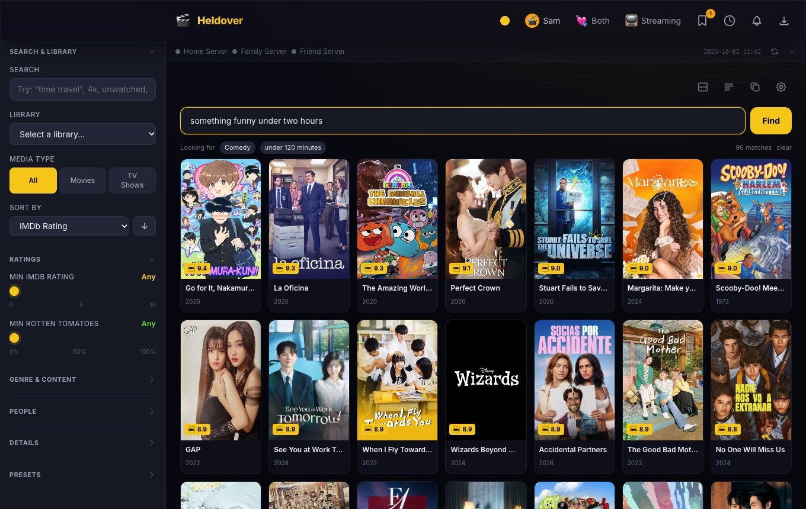

Heldover tells you what it understood. Look for the small labels after **Looking for**, such as *Comedy* and *under 120 minutes*. If a label is wrong, change your sentence and press **Find** again.

Two tips:

- Heldover works from the titles it already knows about. If you just added a server, give it a minute to read the libraries.
- The microphone button in the toolbar lets you speak your request instead of typing it.

## Mood shelves

Below the ask box you see rows of **mood shelves**: *Cozy*, *Short*, *New this week*, *Funny*, *Mind-bending* and more. Each shelf shows titles you can actually play. Scroll a shelf sideways with the arrow button or your mouse wheel.

# 6. Browse one library

Sometimes you want to browse. Use the **Library** menu in the left panel to choose one library, for example *Movies - 4K*.

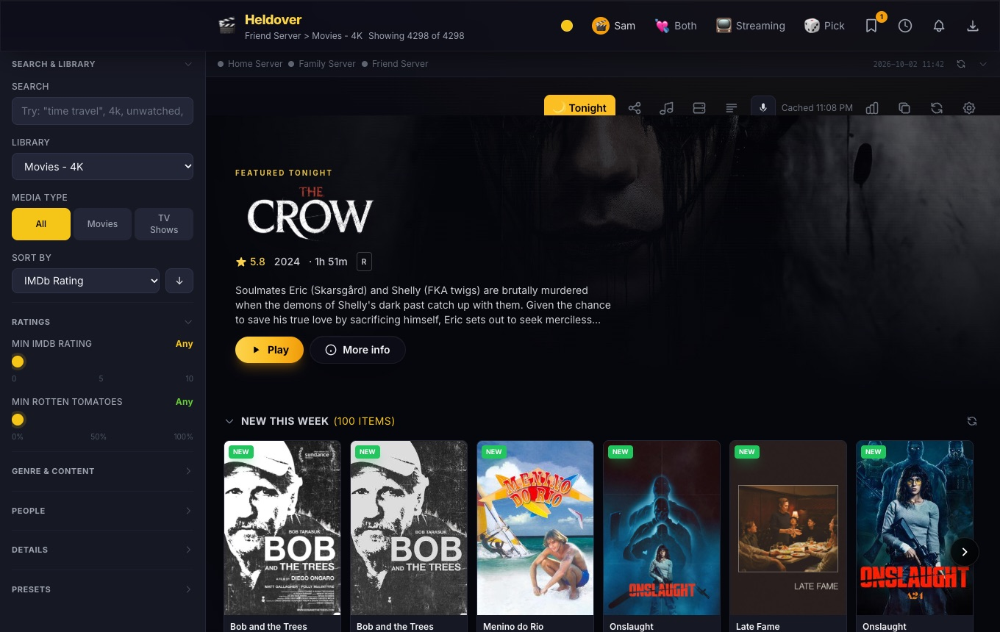

At the top you see a **Featured tonight** banner. Under it is a **New this week** row, then the rest of the library.

If you add a free Fanart.tv key in Settings, the banner shows a wide backdrop and a logo. Without a key it shows the poster instead. Both work.

## Filters

The left panel narrows what you see. Click a heading to open it.

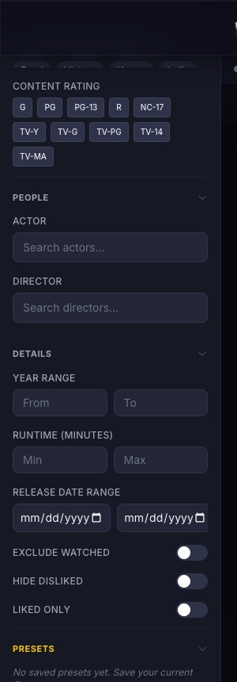

- **Search:** type a word, a name, or a phrase such as `4k` or `unwatched`.
- **Media type:** all, movies only, or TV shows only.
- **Sort by:** IMDb rating and other options. The arrow flips the order.
- **Ratings:** set a minimum IMDb or Rotten Tomatoes score.
- **Genre and content:** pick genres, and content ratings such as PG-13 or TV-MA.
- **People:** search for an actor or a director.
- **Details:** set a year range, a runtime range, or a release date range. You can also hide titles you already watched, hide titles you disliked, or show only titles you liked.
- **Presets:** save a set of filters under a name and bring it back with one click.

Heldover shows **real** ratings from several sources. Shared servers often report one flat number. Heldover looks up the real ones. Add free OMDb and MDBList keys in Settings for even more sources.

# 7. A title up close

Click any poster to open its detail page.

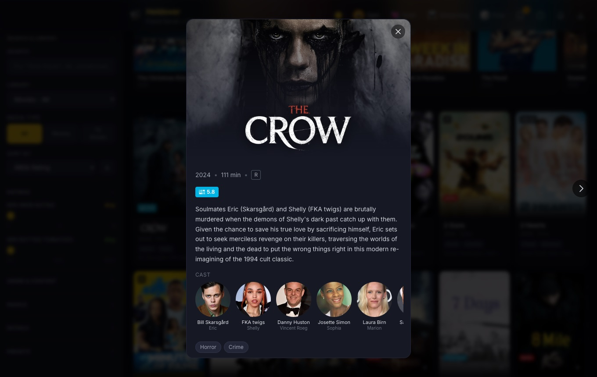

You see the poster or backdrop, the year, the runtime, the rating, a plot summary and the cast. Many titles also have these buttons:

- **Play:** choose where to start it.
- **Trailer:** watch the trailer, using YouTube's privacy-friendly player.
- **Send this to the TV:** cast it to a TV (chapter 11).
- **Thumbs up or down:** tell Heldover what you like. It uses this for your recommendations.
- **Watch later:** save it to your queue.
- **Follow:** for a TV show, get an alert when a new episode arrives.
- **Similar:** see titles like this one. Titles you already have are marked.

# 8. Tonight and swipe

## Tonight

Press the **Tonight** button (or the **T** key) when you do not want to think.

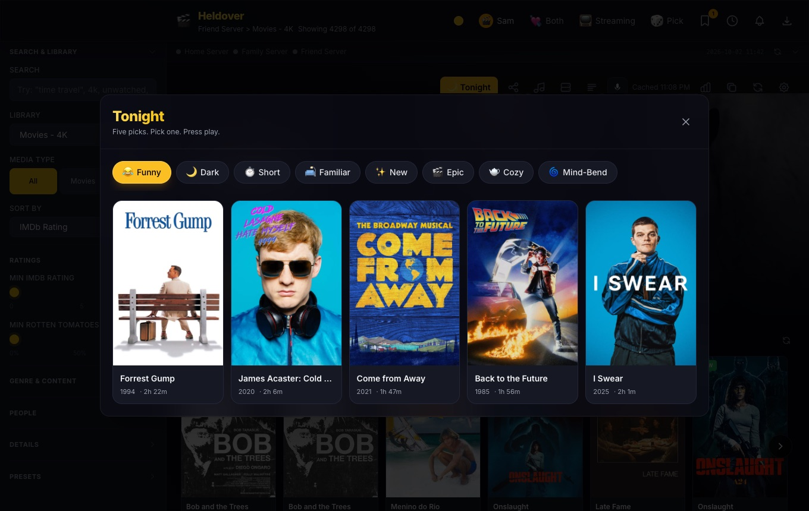

Choose a mood: *Funny*, *Dark*, *Short*, *Familiar*, *New*, *Epic*, *Cozy* or *Mind-bend*. Heldover shows five picks. Pick one and press play.

## Swipe together

Two people never agree. Swipe mode fixes that. Press **Both** in the top bar.

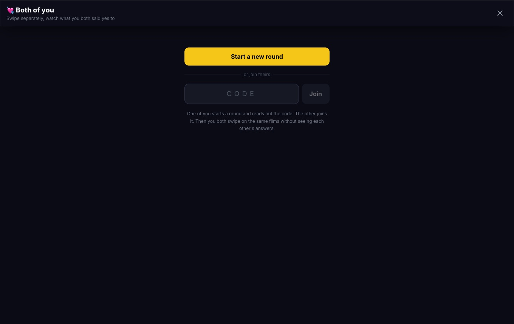

1. One person presses **Start a new round**. Heldover shows a 4-letter code.
2. The other person opens Heldover on their own phone, types the code, and presses **Join**.
3. You both swipe on the same films. You cannot see each other's answers.
4. Heldover names the first film you both said yes to.

# 9. Streaming browse

Press **Streaming** in the top bar to see what is on Netflix, Disney+, Max, Prime Video, Hulu, Apple TV+, Paramount+, Peacock, Crunchyroll and Tubi.

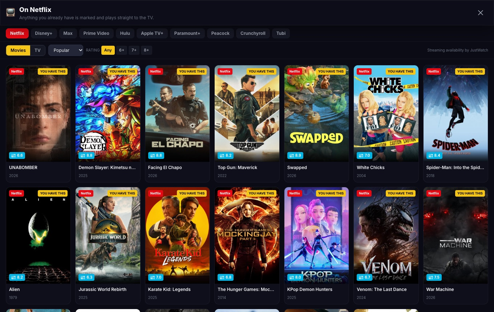

Titles that you already have on a Plex server carry a **YOU HAVE THIS** label. That tells you not to pay for something you own. Click one to play your copy.

The availability data comes from JustWatch, through TMDB.

# 10. Servers

Press the server icon (or the **V** key) to open the **Servers** panel.

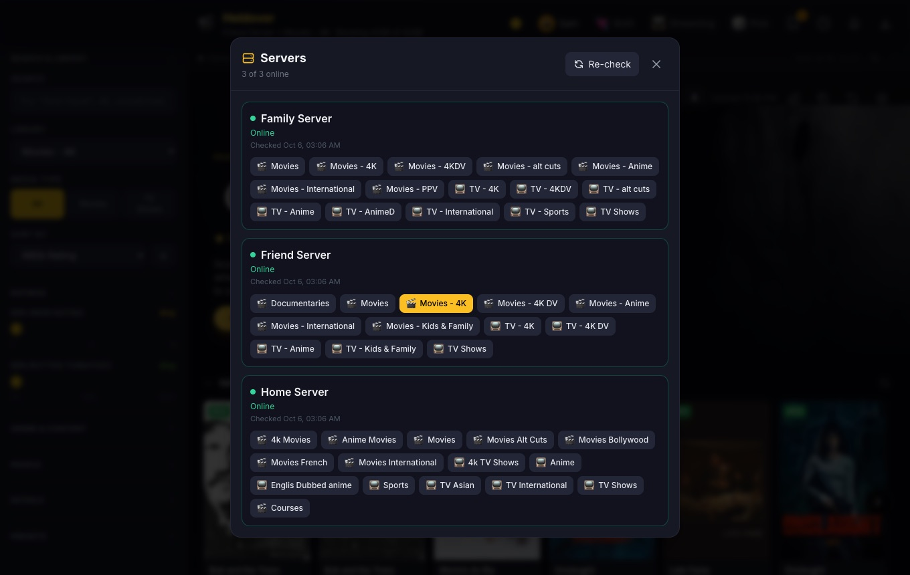

It shows every server you can reach, and whether it is online. Under each server you see its libraries. Click a library to open it.

If a server is slow or offline, Heldover skips it and carries on. Press **Re-check** to ask all servers again.

A server that Plex has not seen for 30 days is skipped on its own. That keeps one dead share from slowing everything down.

# 11. Cast to your TV

Heldover can start a film on most smart TVs over DLNA. You do not need the Plex app on the TV.

1. Make sure the computer running Heldover and the TV are on the same network.
2. Open a title and press **Send this to the TV**.
3. Choose your TV from the list.

If the TV cannot play the file, Heldover converts it on the fly. This needs ffmpeg. The Docker image includes it. For the desktop app or a source install, install ffmpeg yourself.

## Approving TVs

Casting is protected. A TV must be **approved** before a phone can cast to it.

- The owner approves a TV in **Settings**, under **TVs**.
- When the owner casts to a TV from the computer that runs Heldover, that TV is approved at the same time.

If you remove a TV from the approved list, its film stops, and its links stop working.

Press **Stop** in Heldover to end a film. Pressing Play on the TV remote after that does not start it again.

# 12. Use it on your phone

Open `http://heldover.local:3001` on any device on the same Wi-Fi. (If that name does not work, use `http://<computer-address>:3001`.) iPhone and Android both work. Add it to your home screen to get an app icon.

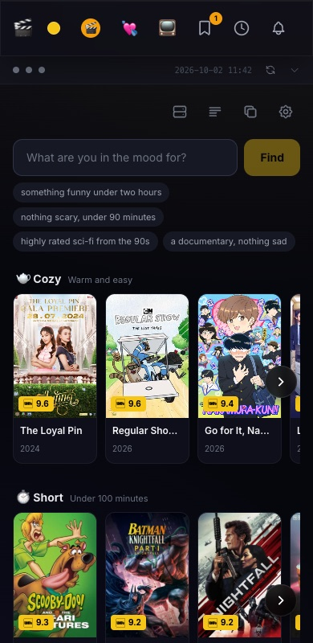

- **Docker or from source:** other devices can open it right away. The server prints its addresses and a QR code at start.
- **Desktop app:** it opens only on its own computer until you turn on **Let phones and other devices on my Wi-Fi connect** in Settings. Settings then shows the address.

A phone can look around at once. To rate, queue or cast from it, you need a PIN (next chapter).

# 13. Settings, the PIN and downloads

Open **Settings** with the gear icon.

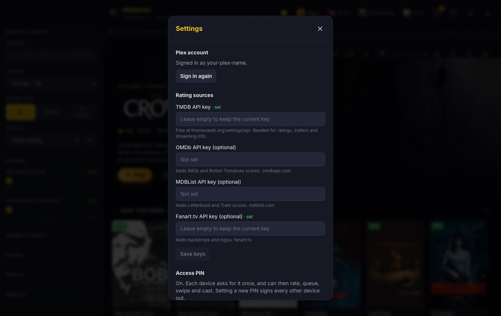

## Who can do what

There are three levels:

| Level | What it covers | Who gets it |
|---|---|---|
| **Look around** | Browse, search, see ratings | Any device on your Wi-Fi. If a PIN is set, only devices that entered it. |
| **Change things** | Rate, hide, queue, swipe, cast, download | Devices that entered the PIN. Without a PIN, only the owner. |
| **Change settings** | The Plex account, keys, the PIN, downloads, approved TVs | Only the owner |

The **owner** is the computer Heldover runs on. It is also any device where you entered the settings code (chapter 2).

**Should you set a PIN?** If you live alone, you can skip it. If other people in the house use their own phones, set one. Without a PIN, their phones can look but cannot rate, queue or cast.

Forgot the PIN? Start Heldover once with `RESET_PIN=1`, or change the PIN in Settings as the owner. Setting a new PIN signs every other device out.

## Optional rating keys

| Service | What it adds |
|---|---|
| [OMDb](https://www.omdbapi.com/apikey.aspx) | IMDb and Rotten Tomatoes scores |
| [MDBList](https://mdblist.com/preferences/) | Letterboxd, Trakt and audience scores |
| [Fanart.tv](https://fanart.tv/get-an-api-key/) | Wide backdrops and logos. Ask for a **project** key, not a personal one. |

All three are free. Paste each key into Settings and press **Save keys**. Fanart.tv then fills in artwork slowly in the background, about one title every second, so a large library takes a few days to finish.

## Downloads

The download buttons are **off** by default. A download copies a file from the server it lives on. That server may belong to a friend who shared their library with you. Turn downloads on only if that is fine with them.

For a shared server, Heldover only offers a download when its owner has switched on **Allow Downloads** for you in Plex.

# 14. Shortcuts and small tools

Press these keys when the page is open:

| Key | What it does |
|---|---|
| **T** | Tonight |
| **R** | Random pick |
| **W** | Watchlist |
| **Q** | Watch later queue |
| **N** | Episode alerts |
| **V** | Servers |
| **L** | Browse lists from MDBList, TMDB, Letterboxd and Trakt |
| **S** | Library stats |
| **P** | Publish your current filter as a shareable view |

A few other buttons in the toolbar are worth knowing:

- **Find duplicates:** finds titles that appear on more than one server.
- **Refresh:** bypasses the stored copy and reads the library again from Plex. Use it after a friend adds something new.
- **Wrapped:** a recap page of your viewing.

# 15. Your privacy

Heldover talks to these outside services and nothing else.

- **plex.tv and your Plex servers:** to sign in, read libraries, play and cast.
- **TMDB:** ratings, trailers, streaming availability and recommendations.
- **OMDb, MDBList and Fanart.tv:** only if you add their keys.
- **YouTube:** only when a trailer plays.
- **Letterboxd and Trakt:** only when you open one of their lists.

There are no analytics and no telemetry. Your Plex sign-in and your keys stay on the computer that runs Heldover. Your browser never receives them.

**Do not put Heldover on the open internet.** It is built for your home network. To reach it from outside, use a VPN such as Tailscale or WireGuard.

Two more safeguards worth knowing:

- Heldover sends your Plex token to a Plex server only over a secure `https` connection.
- A device on your Wi-Fi without the PIN can look but cannot change anything.

Found a security problem? Read `SECURITY.md` in the project and report it privately.

# 16. When something goes wrong

**The page is empty, or a library does not open.**
Press **Refresh** in the toolbar. Then open the **Servers** panel and press **Re-check**. If a server shows offline, ask its owner whether it is running.

**Heldover asks me to sign in to Plex again.**
Open **Settings** and press **Sign in again** under *Plex account*.

**My phone shows the page but cannot rate or queue.**
Set a PIN in Settings, then enter it once on the phone.

**My phone cannot cast to the TV.**
The owner must approve that TV first (chapter 11). Also check that the TV and the computer running Heldover are on the same network.

**The TV cannot be found.**
Check that the TV is switched on and on the same Wi-Fi. Docker needs host networking for TV discovery.

**The first launch shows a security warning on Windows or Mac.**
That is expected for an unsigned app. See chapter 1.

**I forgot my PIN.**
Start Heldover once with `RESET_PIN=1`, or change it in Settings as the owner.

**It says "That settings code is not right".**
Look at the code printed at the last start. It changes if Heldover loses its settings file.

**Heldover will not start and mentions the settings file.**
The settings file is damaged. Repair it, or move it away to start again with new settings. Heldover does not start with blank settings on its own. That protects your PIN.

**A film in the TV queue plays slowly or stutters.**
Some older file types (such as `avi`) convert slowly. Try another copy of the title.

# 17. Words used in this guide

**Library:** a collection of movies or shows on a Plex server.

**Owner:** the person who runs Heldover. They can change settings.

**Settings code:** a short code printed when Heldover starts. It proves you are the owner from another device.

**PIN:** a 6 to 12 digit number that unlocks changing things from other devices.

**Token:** a long secret that proves to Plex that a request comes from you.

**DLNA:** a standard that lets one device start a film on another over your network.

**Project key:** a key you request for an app, as opposed to a key tied to your own account.

# Where to get help

- Questions and bug reports: [github.com/anthonyonazure/heldover/issues](https://github.com/anthonyonazure/heldover/issues)
- The project page: [github.com/anthonyonazure/heldover](https://github.com/anthonyonazure/heldover)
